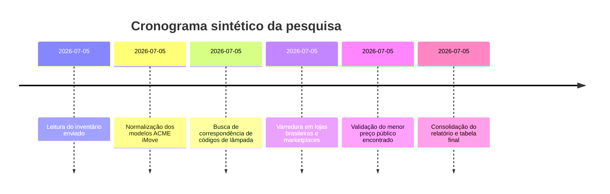

# Relatório analítico de pesquisa de lâmpadas compatíveis

Data da pesquisa: 2026-07-05  
Idioma: pt-BR

## Resumo executivo

O inventário informado contém 7 equipamentos ACME iMove distribuídos em 3 modelos: IM-575W2/FC, IM-575SP2/FC e IM-575S.

Resultado prático:

- Para o modelo **ACME iMove 575W (IM-575W2/FC)**, o inventário informa compatibilidade com **MSD 575W / MSR 575/2W**. O menor anúncio brasileiro com preço público encontrado foi da **OneLight Brasil**, por **R$ 99,00**.
- Para os modelos **ACME iMove 575SP (IM-575SP2/FC)** e **ACME iMove 575S (IM-575S)**, o inventário informa apenas **HMI 575W**, sem subtipo/base/soquete. Por isso, a pesquisa foi classificada como **insuficiente para cravar compatibilidade exata** com segurança comercial. Nesses casos, o preço final foi marcado como **não disponível** para correspondência exata, embora tenham surgido alternativas próximas no mercado brasileiro.

---

## Fonte do inventário usado

Arquivo-base do usuário: `inventario_moving_identificado_por_lataria.md`

Equipamentos extraídos:

1. ACME iMove 575W — IM-575W2/FC — lâmpada: MSD 575W / MSR 575/2W
2. ACME iMove 575SP — IM-575SP2/FC — lâmpada: HMI 575W
3. ACME iMove 575SP — IM-575SP2/FC — lâmpada: HMI 575W
4. ACME iMove 575SP — IM-575SP2/FC — lâmpada: HMI 575W
5. ACME iMove 575SP — IM-575SP2/FC — lâmpada: HMI 575W
6. ACME iMove 575S — IM-575S — lâmpada: HMI 575W
7. ACME iMove 575W — IM-575W2/FC — lâmpada: MSD 575W / MSR 575/2W

---

## Método e fontes priorizadas

### Critérios

- priorização de lojas e anúncios em pt-BR/Brasil;
- uso do modelo extraído do inventário como fonte primária;
- aceitação de preço apenas quando o anúncio mostrava valor público de forma direta;
- quando o anúncio era apenas aproximado, sem base/soquete confirmado, o item foi marcado como “não disponível” para correspondência exata;
- frete só foi considerado quando explicitamente exibido na página.

### Fontes priorizadas

- Mercado Livre
- Amazon Brasil
- Americanas / Submarino / Magalu / Kabum
- OLX
- lojas especializadas brasileiras de iluminação cênica
- fabricantes / páginas de produto quando aplicável

---

## Cronograma da pesquisa

---

## Tabela resumo

| Equipamento | Modelo | Tipo lâmpada | Preço (BRL) | Link | Vendedor | Data |
|---|---|---|---:|---|---|---|
| ACME iMove 575W | IM-575W2/FC | MSD 575W / MSR 575/2W | 99,00 | https://www.onelightbrasil.com.br/lampada-para-moving-excell-575w-msr-575-2 | OneLight Brasil | 2026-07-05 |
| ACME iMove 575SP | IM-575SP2/FC | HMI 575W | não disponível | https://www.showdeluz.com.br/lampadas/lampadas-halogenas/lp-575w-hmi-sel-g22-osram | Show de Luz | 2026-07-05 |
| ACME iMove 575SP | IM-575SP2/FC | HMI 575W | não disponível | https://www.showdeluz.com.br/lampadas/lampadas-halogenas/lp-575w-hmi-sel-g22-osram | Show de Luz | 2026-07-05 |
| ACME iMove 575SP | IM-575SP2/FC | HMI 575W | não disponível | https://www.showdeluz.com.br/lampadas/lampadas-halogenas/lp-575w-hmi-sel-g22-osram | Show de Luz | 2026-07-05 |
| ACME iMove 575SP | IM-575SP2/FC | HMI 575W | não disponível | https://www.showdeluz.com.br/lampadas/lampadas-halogenas/lp-575w-hmi-sel-g22-osram | Show de Luz | 2026-07-05 |
| ACME iMove 575S | IM-575S | HMI 575W | não disponível | https://www.showdeluz.com.br/lampadas/lampadas-halogenas/lp-575w-hmi-sel-g22-osram | Show de Luz | 2026-07-05 |
| ACME iMove 575W | IM-575W2/FC | MSD 575W / MSR 575/2W | 99,00 | https://www.onelightbrasil.com.br/lampada-para-moving-excell-575w-msr-575-2 | OneLight Brasil | 2026-07-05 |

---

## Detalhamento por equipamento

### Equipamento 1

- Equipamento: ACME iMove 575W
- Modelo: IM-575W2/FC
- Tipo/código da lâmpada: MSD 575W / MSR 575/2W
- Menor preço encontrado: R$ 99,00
- Anúncio: https://www.onelightbrasil.com.br/lampada-para-moving-excell-575w-msr-575-2
- Vendedor/loja: OneLight Brasil
- Data da pesquisa: 2026-07-05
- Observações:
  - anúncio brasileiro com preço público acessível;
  - página informa disponibilidade imediata;
  - frete não especificado publicamente, apenas cálculo por CEP;
  - compatibilidade comercial plausível porque o próprio inventário aceita MSD 575W ou MSR 575/2W.
- Imagem do anúncio:
  - https://cdn.awsli.com.br/600x700/2454/2454497/produto/165025228/lampada-para-moving-excell-575w-msr-575-2-c468d1c2.jpg

### Equipamento 2

- Equipamento: ACME iMove 575SP
- Modelo: IM-575SP2/FC
- Tipo/código da lâmpada: HMI 575W
- Menor preço encontrado: não disponível
- Anúncio principal analisado: https://www.showdeluz.com.br/lampadas/lampadas-halogenas/lp-575w-hmi-sel-g22-osram
- Vendedor/loja: Show de Luz
- Data da pesquisa: 2026-07-05
- Observações:
  - o inventário informa apenas HMI 575W, sem subtipo/base/soquete;
  - foi localizado anúncio brasileiro de HMI 575W, mas sem preço público capturado de forma confiável;
  - alternativa aproximada com preço público: https://www.onelightbrasil.com.br/lampada-para-mooving-head-575-original — R$ 165,00;
  - antes da compra, conferir base/soquete, ignição e compatibilidade elétrica.
- Imagem de alternativa:
  - https://cdn.awsli.com.br/600x700/2454/2454497/produto/165025227/lampada-para-mooving-head-575-original-9e0bd6c0.jpg

### Equipamento 3

- Equipamento: ACME iMove 575SP
- Modelo: IM-575SP2/FC
- Tipo/código da lâmpada: HMI 575W
- Menor preço encontrado: não disponível
- Anúncio principal analisado: https://www.showdeluz.com.br/lampadas/lampadas-halogenas/lp-575w-hmi-sel-g22-osram
- Vendedor/loja: Show de Luz
- Data da pesquisa: 2026-07-05
- Observações:
  - mesma situação do equipamento 2;
  - alternativa aproximada com preço público: https://www.onelightbrasil.com.br/lampada-para-mooving-head-575-original — R$ 165,00.
- Imagem de alternativa:
  - https://cdn.awsli.com.br/600x700/2454/2454497/produto/165025227/lampada-para-mooving-head-575-original-9e0bd6c0.jpg

### Equipamento 4

- Equipamento: ACME iMove 575SP
- Modelo: IM-575SP2/FC
- Tipo/código da lâmpada: HMI 575W
- Menor preço encontrado: não disponível
- Anúncio principal analisado: https://www.showdeluz.com.br/lampadas/lampadas-halogenas/lp-575w-hmi-sel-g22-osram
- Vendedor/loja: Show de Luz
- Data da pesquisa: 2026-07-05
- Observações:
  - mesma situação do equipamento 2;
  - alternativa aproximada com preço público: https://www.onelightbrasil.com.br/lampada-para-mooving-head-575-original — R$ 165,00.
- Imagem de alternativa:
  - https://cdn.awsli.com.br/600x700/2454/2454497/produto/165025227/lampada-para-mooving-head-575-original-9e0bd6c0.jpg

### Equipamento 5

- Equipamento: ACME iMove 575SP
- Modelo: IM-575SP2/FC
- Tipo/código da lâmpada: HMI 575W
- Menor preço encontrado: não disponível
- Anúncio principal analisado: https://www.showdeluz.com.br/lampadas/lampadas-halogenas/lp-575w-hmi-sel-g22-osram
- Vendedor/loja: Show de Luz
- Data da pesquisa: 2026-07-05
- Observações:
  - mesma situação do equipamento 2;
  - alternativa aproximada com preço público: https://www.onelightbrasil.com.br/lampada-para-mooving-head-575-original — R$ 165,00.
- Imagem de alternativa:
  - https://cdn.awsli.com.br/600x700/2454/2454497/produto/165025227/lampada-para-mooving-head-575-original-9e0bd6c0.jpg

### Equipamento 6

- Equipamento: ACME iMove 575S
- Modelo: IM-575S
- Tipo/código da lâmpada: HMI 575W
- Menor preço encontrado: não disponível
- Anúncio principal analisado: https://www.showdeluz.com.br/lampadas/lampadas-halogenas/lp-575w-hmi-sel-g22-osram
- Vendedor/loja: Show de Luz
- Data da pesquisa: 2026-07-05
- Observações:
  - o inventário informa HMI 575W, mas sem subtipo/base;
  - alternativa aproximada com preço público: https://www.onelightbrasil.com.br/lampada-para-mooving-head-575-original — R$ 165,00;
  - conferir soquete e necessidade de ignitor/ballast compatível.
- Imagem de alternativa:
  - https://cdn.awsli.com.br/600x700/2454/2454497/produto/165025227/lampada-para-mooving-head-575-original-9e0bd6c0.jpg

### Equipamento 7

- Equipamento: ACME iMove 575W
- Modelo: IM-575W2/FC
- Tipo/código da lâmpada: MSD 575W / MSR 575/2W
- Menor preço encontrado: R$ 99,00
- Anúncio: https://www.onelightbrasil.com.br/lampada-para-moving-excell-575w-msr-575-2
- Vendedor/loja: OneLight Brasil
- Data da pesquisa: 2026-07-05
- Observações:
  - mesmo resultado do equipamento 1;
  - frete não especificado publicamente;
  - disponibilidade imediata mostrada na página no momento da pesquisa.
- Imagem do anúncio:
  - https://cdn.awsli.com.br/600x700/2454/2454497/produto/165025228/lampada-para-moving-excell-575w-msr-575-2-c468d1c2.jpg

---

## Alternativas quando não disponível

Para os casos HMI 575W sem subtipo/base definidos no inventário, as alternativas pesquisadas foram:

- anúncio brasileiro de HMI 575W G22 da Show de Luz:
  - https://www.showdeluz.com.br/lampadas/lampadas-halogenas/lp-575w-hmi-sel-g22-osram
- alternativa genérica de moving head 575 com preço público na OneLight Brasil:
  - https://www.onelightbrasil.com.br/lampada-para-mooving-head-575-original
- alternativa brasileira aproximada na Musitech:
  - https://www.musitechinstrumentos.com.br/Produto_21091%2C248/Iluminacao/Acessorios/Lampada-Osram-EMH-575-WSE75-PMoving-575.html?srsltid=AfmBOorK6s2o-EEb0mHZWX6surqPICl0eOqbSp4VyDfxsq6Am9G9SX_b

---

## Conclusão operacional

- compra mais objetiva encontrada: **OneLight Brasil — Lâmpada Para Moving Excell 575w - Msr 575/2 — R$ 99,00**;
- para os equipamentos HMI 575W, o inventário não traz detalhe suficiente para fechar compra sem risco de erro de base/soquete;
- nesses casos, o caminho mais seguro é validar visualmente a lâmpada atual, o soquete e o part number gravado no bulbo antes de comprar.
